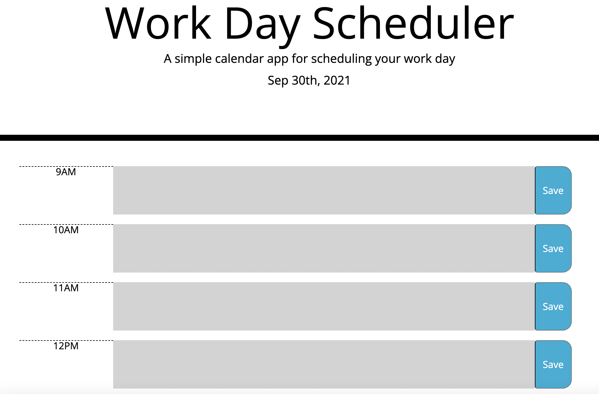
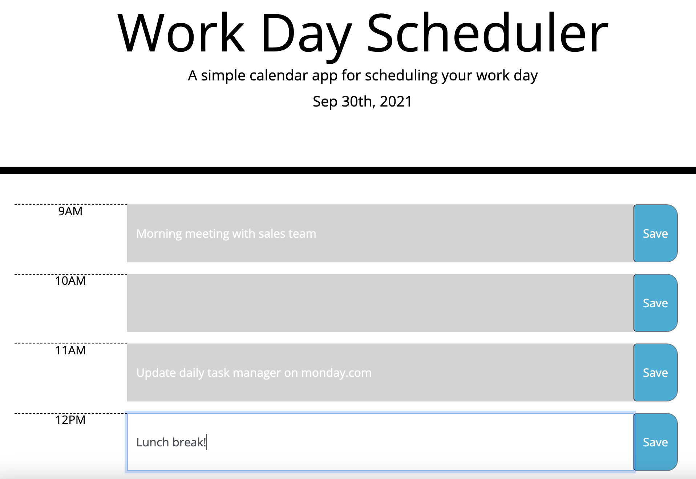

# work-day-scheduler
On this website, you are able to create tasks to plan out your work day. This will up productivity and is a good way to start off your day by planning it all out. Also, even if you refresh your page, your scheduler is saved and you can come back to it. Lastly, the task blocks will change depending on the time of day.

## Deployment
The website is available for use [here](https://kelliekumasaka.github.io/work-day-scheduler/). 

## Contents
The website looks like the below pictures when you open the site and you can input your tasks into the task bar area.

## Summary
The fully deployed website has a clean look and helpful for busy working people.